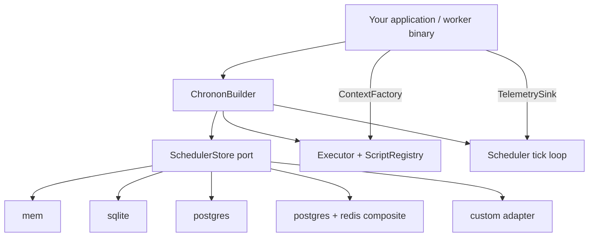

[](https://github.com/unified-field-dev/chronon/actions/workflows/ci.yml)
[](https://crates.io/crates/uf-chronon)
[](https://crates.io/crates/uf-chronon)
[](https://docs.rs/uf-chronon)
[](https://github.com/unified-field-dev/chronon/blob/main/Cargo.toml)
[](LICENSE)

[GitHub](https://github.com/unified-field-dev/chronon) · [crates.io](https://crates.io/crates/uf-chronon) · [docs.rs](https://docs.rs/uf-chronon) · [Benchmarks](chronon-bench/PERFORMANCE_STUDY.md)

# Chronon

The crates.io package is **`uf-chronon`** (`chronon` is taken). Imports stay `use chronon::…`:

```toml
[dependencies]
chronon = { package = "uf-chronon", version = "0.1", features = ["mem"] }
tokio = { version = "1", features = ["rt-multi-thread", "macros"] }
serde_json = "1"
```

```rust
use std::sync::Arc;

use chronon::prelude::*;
use chronon::InMemorySchedulerStore;

#[chronon::script(name = "nightly_cleanup")]
async fn nightly_cleanup(
    ctx: Box<dyn ScriptContext>,
    retention_days: u32,
) -> chronon::Result<()> {
    println!("{}: retaining {retention_days} days", ctx.label());
    Ok(())
}

#[tokio::main]
async fn main() -> chronon::Result<()> {
    let chronon = Chronon::builder()
        .scheduler_store(Arc::new(InMemorySchedulerStore::new()))
        .context_factory(Arc::new(JsonScriptContextFactory))
        .embedded()
        .auto_registry()
        .build()?;

    // Recurring: run every day at 02:00 UTC.
    let mut nightly = Job::new("nightly-schedule", "nightly_cleanup");
    nightly.schedule_kind = ScheduleKind::Cron;
    nightly.cron_expr = Some("0 2 * * *".into());
    nightly.timezone = Some("UTC".into());
    nightly.params_json = serde_json::json!({ "retention_days": 7 });
    chronon.coordinator_service().upsert_job(nightly).await?;

    // Manual: enqueue an immediate run of the same script.
    let mut manual = Job::new("cleanup-now", "nightly_cleanup");
    manual.schedule_kind = ScheduleKind::Manual;
    manual.params_json = serde_json::json!({ "retention_days": 30 });
    let manual_id = manual.job_id.clone();
    chronon.coordinator_service().upsert_job(manual).await?;
    chronon.coordinator_service().run_now(&manual_id).await?;

    chronon.run().await
}
```

## About Chronon

Chronon is a Rust cron and run-once scheduler for services that need typed script handlers, durable job/run history, and an optional coordinator–worker split. Its thin [`SchedulerStore`](chronon-core/src/store.rs) port supports in-memory, SQLite, PostgreSQL, and PostgreSQL+Redis storage without locking an application into one database or a full workflow engine.

## Performance

Representative AWS in-VPC results (`aws-c6i.large` cells with an `aws-t3.medium` baseline):

| Surface | Result | Config |
|---------|--------|--------|
| Worker claim (hybrid) | **~1,000 claims/s** | postgres-redis, W=32, Q=10k (vs postgres ~296/s) |
| Multi-cell fleet | **7,742 claims/s** @ 16 cells (~470/s/cell, near-linear) | postgres-redis, W=1/host, Q=100k (D5 T5) |
| Cron evaluation | **~396k evals/s** (vs croner ~187k) | `CronExpr`, no store |
| Leader failover | **p95 331 ms** (≤ 2× tick interval) | postgres-redis (BM-CH4) |
| Empty-tick latency | **p50 ~252 ms** (tick-interval bound) | mem, 250 ms tick |

The sync-Postgres claim path scales **horizontally by cell** (~470/s each), not by workers or batching — ~21 cells project to 10k claims/s. Redis Cluster, larger instances, PgBouncer, and claim batching did not lift the per-cell ceiling (D5 T1–T4, T6).

Full methodology, caveats, and sizing guidance: [`PERFORMANCE_STUDY.md`](chronon-bench/PERFORMANCE_STUDY.md). Experiment registry: [`EXPERIMENTS.md`](chronon-bench/EXPERIMENTS.md).

## Why Chronon

| Pain | Chronon answer |
|------|----------------|
| Reinventing cron + job/run persistence per project | Thin async port — jobs, runs, revisions, leases |
| Tight coupling to one database | Feature-gated backends behind one trait |
| Monolith-only scheduled tasks | Embedded, coordinator, worker, and remote-client assembly via builder |
| Untyped script parameters | `#[chronon::script]` generates typed params + registry metadata |
| Identity at schedule time vs run time | Host `ContextFactory` reconstructs execution context from stored JSON |

A **job** references a stable **script** name and schedule config. Each **run** is one execution attempt with status, timings, and captured output. **Revisions** version job config changes.

## Architecture



Your application owns identity policy, routing, and business logic. Chronon owns scheduling semantics: due queries, claiming, cron evaluation, and script dispatch.

## Getting started

`#[chronon::script]` registers a callable; a [`Job`](chronon-core/src/models/job.rs) carries the schedule (`Cron` / `RunOnce` / `Manual`) and is persisted via `upsert_job`. Cron expressions use standard five-field syntax with an optional timezone; six-field expressions may include seconds. Runnable samples: `script_macro`, `script_handle_job`, `run_now`, and `embedded_tick`:

```bash
cargo run -p uf-chronon --example script_macro --features mem
```

Enable features explicitly — the facade ships with **no default features** (`default = []`). See [Cargo features](#cargo-features) below.

### Durable storage (SQLite)

For file-backed persistence without external services:

```toml
chronon = { package = "uf-chronon", version = "0.1", features = ["sqlite"] }
```

```bash
cargo run -p uf-chronon --example sqlite_boot --features sqlite
```

See [`chronon-backend-sqlite/README.md`](chronon-backend-sqlite/README.md); for Postgres / Redis see [`chronon-backend-postgres`](chronon-backend-postgres/README.md) and [`chronon-backend-redis`](chronon-backend-redis/README.md).

API details: [`chronon/README.md`](chronon/README.md) and `cargo doc -p uf-chronon --all-features --open`.

## Cargo features

| Feature | Backend / module | Status |
|---------|------------------|--------|
| `mem` | In-memory store | Ready — tests and local dev |
| `sqlite` | `SqliteSchedulerStore` | Ready — embedded file-backed, PR CI |
| `postgres` | `PostgresSchedulerStore` | Ready — shared durable production |
| `redis` | `PostgresRedisSchedulerStore` | Ready — Postgres + Redis claim overlay (**requires `postgres`**) |
| `axum` | HTTP API router | Ready — mount on host Axum server |
| `telemetry-console` | Console telemetry sink | Optional marker |
| *(none)* | Port + DTOs + builder only | `default-features = false` |

Shipped adapters implement [`SchedulerStore`](chronon-core/src/store.rs) and plug into [`ChrononBuilder`](chronon-runtime/src/builder.rs). Connect snippets and env vars live in the per-crate READMEs under `chronon-backend-*`; runnable boots: `sqlite_boot`, `postgres_boot`, `postgres_redis_boot`.

## Deployment shapes

Selected via **`ChrononBuilder`** — not a global mode enum:

| Shape | Builder | Use when |
|-------|---------|----------|
| **Embedded** | `.embedded()` | Scheduler tick + worker in one process |
| **Coordinator** | `.coordinator_only()` | Enqueue / tick only (split binary) |
| **Worker** | `.worker(pool_id)` | Claim + execute only |
| **Remote client** | `.remote_coordinator(url)` | HTTP proxy to a remote coordinator API |

## When to use it

**Good fit**

- Cron, run-once, and manual job triggers for Rust functions
- Coordinator–worker split with leases and partitions
- Systems that need a storage port, not a full BPM/workflow suite

**Not a fit**

- Canonical system-of-record for all app data (use your ORM above the port)
- Cross-language script execution (Chronon runs Rust handlers)
- Built-in ops UI (build admin UI above the HTTP API)

## Workspace

| Crate | Role |
|-------|------|
| `chronon` | Public facade (re-exports) |
| `chronon-core` | Port, DTOs, router, identity ports |
| `chronon-telemetry` | `TelemetrySink`, console instrumentation |
| `chronon-backend-mem` | In-memory `SchedulerStore` |
| `chronon-backend-sql-common` | Shared SQL implementation |
| `chronon-backend-sqlite` | SQLite adapter |
| `chronon-backend-postgres` | PostgreSQL adapter |
| `chronon-backend-redis` | Postgres + Redis claim composite |
| `chronon-runtime` | `Chronon`, `ChrononBuilder`, runtime loops |
| `chronon-scheduler` | Tick loop, due query, partitions |
| `chronon-executor` | Script registry and invoke |
| `chronon-axum` | HTTP API |
| `chronon-macros` | `#[chronon::script]` |
| `chronon-testkit` / `chronon-e2e` / `chronon-bench` | Verification matrix and BM-CH* / BM-CH7-D hyperscale campaigns |

## Benchmarks

Decision-grade numbers live under `profiling/chronon-bench/reports/`. Run locally or on AWS:

```bash
# List experiments and run a smoke cell
cargo run -p chronon-bench -- experiments
./chronon-bench/scripts/run-ch7-multibench-smoke.sh

# AWS hyperscale campaign (D5 ladder T0–T7) — see infra/aws/chronon/scaling-fleet/
./infra/aws/chronon/scaling-fleet/scripts/run-ch7-d5-full-ladder-aws.sh
```

Registry and sweep phases: [`chronon-bench/EXPERIMENTS.md`](chronon-bench/EXPERIMENTS.md). Interpretation and sizing: [`chronon-bench/PERFORMANCE_STUDY.md`](chronon-bench/PERFORMANCE_STUDY.md).

## Verify

```bash
cargo test --workspace
cargo check -p uf-chronon --no-default-features
cargo check -p uf-chronon --features mem,telemetry-console
cargo check -p uf-chronon --features sqlite,postgres,redis,axum
cargo clippy --workspace --all-targets -- -D warnings
```

## Documentation

Architecture and quick start live in this README. API contracts, configuration, and examples live in rustdoc — start with `cargo doc -p uf-chronon --all-features --open`.

## Contributing

See [`CONTRIBUTING.md`](CONTRIBUTING.md), [`SECURITY.md`](SECURITY.md), and [`CODE_OF_CONDUCT.md`](CODE_OF_CONDUCT.md).
