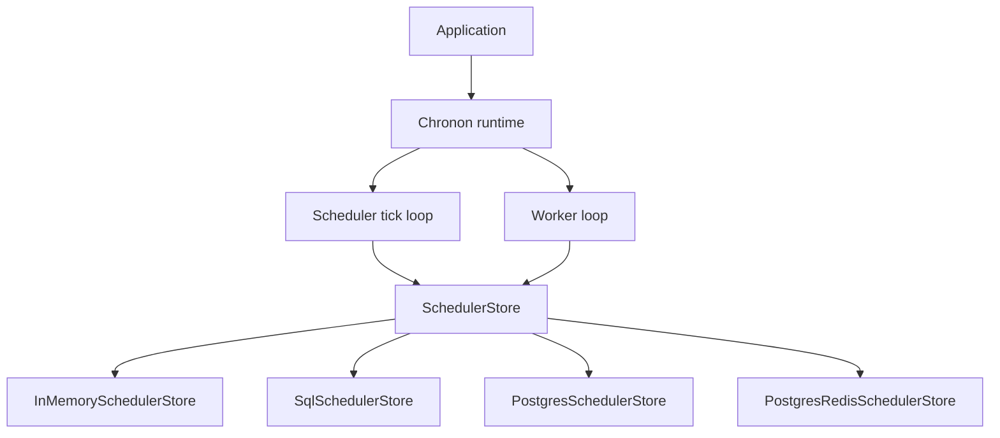

# Chronon scheduler performance across storage adapters and deployment shapes

Pre-registered workloads and runner commands: [`EXPERIMENTS.md`](EXPERIMENTS.md).

Decision-grade numbers use AWS hardware profiles only (`aws-t3.medium`, `aws-c6i.large`, scaling-fleet). Harness smoke on developer machines is non-authoritative.

---

## Executive summary

Chronon is a **scheduled job runtime** with a pluggable `SchedulerStore`. Applications register cron jobs and run-once work; Chronon ticks on an interval, discovers due jobs, enqueues runs, and workers claim and execute scripts. Storage adapters (`mem`, `sqlite`, `postgres`, `postgres-redis`) provide durability and optional Redis-accelerated claims.

**Measured scope**

| Surface | Status | Key number |
|---------|--------|------------|
| **Tick latency** (BM-CH0) | **Measured** | p95 **~255 ms** @ aws-t3.medium (tick-interval bound) |
| **Due-job query** (BM-CH1) | **Measured** | p95 **~5.3 ms** @ 1k jobs (postgres-redis) |
| **Cron evaluation** (BM-CH2) | **Measured** (method; re-run on AWS if needed) | **~396k evals/s** vs croner **~187k** |
| **Sustained tick** (BM-CHL) | **Measured** | p99 **~6.3 s** @ 10k due/tick (CHL3) |
| **Claim capacity** (BM-CH7 Track A) | **Measured** | **~1,000/s** hybrid gate @ W=32, Q=10k |
| **Hyperscale multibench** (BM-CH7 D3) | **Measured** (4× c6i.large) | **~2,104/s** aggregate @ bc=2, Q=100k |
| **Multi-cell fleet** (BM-CH7 D5 T5) | **Measured** (16× c6i.large + 16 cells) | **7,742/s** @ 16 cells — 10k gate not met, ~470/s/cell linear |
| **Production drain** (BM-CH7D D5 T7) | **Measured** (single cell) | **~630/s** flat across Wn (execute-path ceiling) |
| **Resilience** (BM-CH3/CH4) | **Measured** | Failover p95 **331 ms** (≤ 500 ms budget) |
| **Execution path** (BM-CH5/CH6) | **Measured** | **~3.6 runs/s**; +32 ms coordinator-worker tax |

**Sizing rule of thumb**

- **mem:** empty tick p50 ≈ configured tick interval; due-query p95 sub-ms class at 1k jobs on lab hardware.
- **sqlite/postgres:** storage RTT tax on tick and query paths; size DB close to scheduler (in-VPC).
- **postgres-redis:** adopt when claim throughput exceeds postgres-only (~296/s @ Q=10k vs ~1k/s hybrid).
- **Single-host bc=1:** ~1k/s plateau on t3.medium — not a configured cap. Authoritative D3 (2026-07-11): 4× c6i.large @ Q=100k peaks **~1,283/s** bc=1; bc=2 fleet **~2,104/s** (efficiency ~0.82); bc=4 **~1,286/s** (sublinear).
- **Horizontal cells scale cleanly:** D5 T5 (2026-07-12) shows ~**470/s per cell** at W=1, near-linear to **7,742/s @ 16 cells**. Reaching 10k/s needs **~21 cells** — the sync-PG claim UPDATE is the per-cell ceiling, not Redis or instance size.
- **Do not** use non-AWS harness labels for production fleet sizing.

**Not measured in this study**

- `remote-client` deployment and HTTP coordinator latency.
- D2 split Postgres/Redis data tier (runbook present; not executed).
- Axum HTTP API surface.
- Product scripts (synthetic noop workloads only).

---

## 1. Introduction

### 1.1 Problem

Services need reliable cron and run-once scheduling with the same API in single-process dev and multi-node production — without hand-rolling leader election, partition assignment, and durable job state. Chronon provides the scheduler runtime; **storage adapters** provide persistence and optional Redis claim acceleration.

### 1.2 Motivation

Adopters must answer:

1. **Given my storage adapter and tick interval, what scheduler overhead can I expect?**
2. **When does Postgres+Redis hybrid pay off** vs Postgres-only for worker claims?
3. **How much does embedded vs coordinator–worker deployment cost** in enqueue-to-run latency?
4. **What due-job count and partition layout** stays within tick budget?
5. **What instance size and backend** minimize $/M scheduled runs?

Benchmarks use synthetic noop scripts only (product-agnostic).

### 1.3 Research questions

| ID | Question | Primary experiments |
|----|----------|---------------------|
| RQ1 | What is empty-tick p50/p95 on each storage adapter? | BM-CH0 |
| RQ2 | How does due-job query scale with job count J and partition count P? | BM-CH1 S1, S3 |
| RQ3 | Does in-tree `CronExpr` beat croner baseline? | BM-CH2 |
| RQ4 | Does partition churn delay ticks beyond 2× baseline? | BM-CH3 |
| RQ5 | Is leader failover recovery ≤ 2× tick interval? | BM-CH4 |
| RQ6 | What is noop script throughput vs raw tokio spawn? | BM-CH5 |
| RQ7 | What is embedded vs coordinator–worker enqueue-to-run delta? | BM-CH6 S6 |
| RQ8 | What is `claim_next_queued` throughput vs worker count W? | BM-CH7 S0, S4 |
| RQ9 | What due jobs/tick can the scheduler sustain with err < 0.1%? | BM-CHL S2 |
| RQ10 | Does postgres-redis beat postgres on claim at production W? | BM-CH7 A/B |
| RQ11 | How does multibench bc scale aggregate claim rate? | BM-CH7 D3 |
| RQ12 | Where do pool count K and data-tier splits knee? | BM-CH7 D1, D2 |
| RQ13 | What is production worker-daemon drain vs store-claim Track A? | BM-CH7D D4 |
| RQ14 | What host projection reaches 10k+/s claims? | D5 ladder T0–T7 + §7.4 release gate |

### 1.4.1 RQ14 — 10k/s release gate (D5 ladder, complete 2026-07-12)

**Pass criteria (non-negotiable):**

| Gate | Metric | Target | Result |
|------|--------|--------|--------|
| **Release** | Aggregate `fleet_wall_claim_ops_per_sec` | **≥ 10,000/s** | **7,742/s @ 16 cells — NOT MET** |
| **Primary row** | postgres-redis, sync PG, W=1/host, Q=100k, in-VPC | Chronon claim semantics | held |
| **Headline** | Sum of per-cell wall rates | Never sum-of-client-max | held (per-cell wall summed) |
| **Campaign complete** | Tiers T0–T7 executed or hard ceiling documented | No skipped topology | **T0–T7 all executed** |

**Autorun:** `infra/aws/chronon/scaling-fleet/scripts/run-ch7-d5-full-ladder-aws.sh` — T0 colocated ceiling → T1 split → T2 sized → T3 Redis Cluster → T4 PG scale → T5 multi-cell fleet → T6 batched claim → T7 BM-CH7D.

**Result — T5 multi-cell scaling (postgres-redis, W=1/host, Q=100k, c6i.large cells):**

| Cells N | Aggregate wall claims/s | Per-cell |
|---------|-------------------------|----------|
| 1 | 442 | 442 |
| 2 | 932 | 466 |
| 4 | 1,809 | 452 |
| 8 | 3,794 | 474 |
| 16 | **7,742** | 484 |

Per-cell wall is **~470/s** and near-flat, so scaling is horizontal-clean; **~21 cells** project to 10k/s. The binding constraint is the per-cell **synchronous Postgres claim UPDATE** — confirmed by T1–T4 (split, sizing, Redis Cluster, PgBouncer all move it <10%) and T6 (claim batching gives no gain, batch=1 best at 2,006/s single cell W=16). T7 BM-CH7D under execute tax is flat at **~630/s** across Wn on one cell.

Sync-PG claims scale by cells, not by workers/batching: **~21 cells** for 10k/s, ~40 for 20k/s. Higher single-cell rates would require an async PG claim path (deferred; out of scope for this study).

### 1.4 Scope

| In scope | Out of scope |
|----------|--------------|
| Chronon runtime + four storage adapters | Product-specific scripts |
| `mem`, `sqlite`, `postgres`, `postgres-redis` | External storage microbenchmarks |
| `embedded`, `coordinator-worker` deployment | `remote-client` (documented, not bench-gated) |
| Telemetry `off`, `console` | Other telemetry sinks |
| BM-CH*, BM-CHL*, BM-CH7-D on AWS profiles | Running campaigns in this document |

### 1.5 Two deployment tiers

| Tier | Storage | Role |
|------|---------|------|
| **Embedded** | `mem` (and lab durable) | Single process: tick + worker; dev, CI, small self-hosted |
| **Production durable** | `sqlite`, `postgres`, `postgres-redis` | Durable job/run state; split coordinator–worker in production |

---

## 2. Architecture and system model

### 2.1 Runtime stack



### 2.2 Tick path (production mental model)

1. Leader coordinator wakes on tick interval.
2. `find_due_job_ids_in_partitions` discovers due jobs for owned partitions.
3. Per job: `claim_job_for_tick` → `create_run` (SQL durable; Redis ZADD if hybrid).
4. Workers: `claim_next_queued` → `execute_script` → status persist.

| Mode | Processes | Typical rate | Bench analogue |
|------|-----------|--------------|----------------|
| **Production embed** | 1 process = tick + worker | Low (cron-driven) | BM-CH0/CH5 embedded |
| **Production split** | Coordinator + N workers | Medium | BM-CH6 coordinator-worker |
| **Capacity stress** | W parallel claimers, Q prefill | Find ceiling | BM-CH7 |

### 2.3 Storage adapters

| Adapter | External deps | Claim path |
|---------|---------------|------------|
| `mem` | None | In-process |
| `sqlite` | File-backed | SQL `claim_next_queued` |
| `postgres` | PostgreSQL | SQL `claim_next_queued` |
| `postgres-redis` | PostgreSQL + Redis | Redis ZPOPMIN + SQL durability |

### 2.4 Dimensions

See [`EXPERIMENTS.md`](EXPERIMENTS.md) for the full matrix. Bench CLI: `--storage`, `--deployment`, `--topology`, `--telemetry`.

---

## 3. Findings summary

| Finding | Configuration | Result | Verdict |
|---------|---------------|--------|---------|
| Tick interval dominates empty tick | mem, embedded, CH0 | p50 ~252 ms | `tick_interval_bound` |
| CronExpr beats croner | CH2, no store | ~396k vs ~187k evals/s | `cron_faster` |
| Due query fast at 1k jobs | mem, CH1 | p95 ~3.7 ms | `query_sublinear` (smoke) |
| CHL0 sustains 10 due/tick | mem | err 0% | `sustain_pass` (smoke) |
| postgres-redis claim gate | c6i.large, CH7 W sweep | ~1,000/s @ W=32, Q=10k | `worker_scaling` |
| Hybrid ROI | CH7 A/B @ W=32 | postgres ~296/s vs hybrid ~1,000/s | `hybrid_wins` |
| Multi-cell fleet scaling | 16× c6i.large + 16 cells, D5 T5 | 7,742/s @ 16 cells (~470/s/cell, linear) | `worker_scaling` |
| Claim batching on sync PG | single cell, D5 T6 | no gain (batch=1 best) | `neutral` |

**Verdict taxonomy:** `tick_interval_bound`, `storage_tax`, `query_sublinear`, `worker_scaling`, `tick_saturated`, `hybrid_wins`, `neutral`, `anti_pattern`.

---

## 4. Experimental methodology

### 4.1 Three metric tracks — do not mix

| Track | IDs | Metric | Use |
|-------|-----|--------|-----|
| **Tick path** | BM-CH0, CH1, CH3, CH4, CHL* | tick/query p50/p95/p99 ms | Scheduler overhead |
| **Execution path** | BM-CH5, CH6 | runs/s, enqueue-to-run ms | Script + deployment tax |
| **Claim capacity** | BM-CH7 | `claim_ops_per_sec` | Worker claim ceiling |

### 4.2 Authoritative test environments

**Tier 1/2 — all backends (`aws-t3.medium`)**

| Field | Value |
|-------|-------|
| Bench | 1× `t3.medium` (2 vCPU, 4 GiB) |
| Topology | `isolated-lab`, deployment `embedded`, telemetry `off` |
| Production env | `CHRONON_TICK_INTERVAL_MS=250`, `CHRONON_NUM_PARTITIONS=16`, `CHRONON_TICK_BATCH_LIMIT=500` |
| Postgres | Colocated Docker `postgres:16-alpine` or dedicated `t3.medium` |
| Redis | Dedicated `t3.medium` for `postgres-redis` |

**Tier 3 capacity (`aws-c6i.large`)**

| Field | Value |
|-------|-------|
| Bench | 1× `c6i.large` + `t3.medium` Postgres + Redis |
| Experiments | BM-CH7 (W ∈ {8,16,32,64}, prefill 10k), BM-CHL2–3 |
| In-VPC | No laptop-over-public-URL decision-grade runs |

**Smoke (`local`)** — method validation only; existing results in Appendix A. Default hardware label when `CHRONON_BENCH_HARDWARE` is unset.

### 4.3 Sweep dimensions

| Phase | Knob | Values | Experiments |
|-------|------|--------|-------------|
| S0 | Worker count W | {8, 16, 32, 64} | BM-CH7 |
| S1 | Job count J | {1k, 10k, 100k} | BM-CH1 |
| S2 | Due jobs/tick D | {10, 100, 1k, 10k} | BM-CHL0–3 |
| S3 | Partition count P | {4, 16, 64} | BM-CH1, BM-CH3 |
| S4 | Prefill Q | {1k, 10k, 100k} | BM-CH7 |
| S5 | Bench clients bc | {1, 2, 4} | BM-CH7 stub |
| S6 | Deployment | embedded, coordinator-worker | BM-CH5, CH6 |
| S7 | Telemetry | off, console | BM-CH0 |

Sweep order: **W → J → P → bc** for capacity; per-backend campaign order in [`EXPERIMENTS.md`](EXPERIMENTS.md).

### 4.4 Pass criteria

| ID | Pass when |
|----|-----------|
| BM-CH0 | Tick p50 flat vs index @ 1k ticks |
| BM-CH1 | Query p95 sub-linear or documented bound vs J |
| BM-CH2 | CronExpr evals/s ≥ croner |
| BM-CH3 | Tick delay p95 ≤ 2× baseline during churn |
| BM-CH4 | Failover ≤ 2× `CHRONON_TICK_INTERVAL_MS` |
| BM-CH5 | runs/s documented vs tokio spawn baseline |
| BM-CH6 | Split vs embedded p95 delta documented |
| BM-CH7 | err < 0.1%; postgres-redis peak > postgres at same W |
| BM-CHL* | err < 0.1% |

### 4.5 Baselines

| Baseline | Experiment |
|----------|------------|
| Raw tokio task spawn | BM-CH5 |
| croner direct eval | BM-CH2 |

---

## 5. Results

Authoritative hardware: `aws-t3.medium` (baseline) and `aws-c6i.large` (hyperscale). Values from committed JSON under `profiling/chronon-bench/reports/`.

### 5.1 Scheduler floor (BM-CH0, BM-CH1) — aws-t3.medium

| Storage | CH0 p50 (ms) | CH0 p95 (ms) | CH1 p95 @ 1k (ms) | Status |
|---------|--------------|--------------|-------------------|--------|
| sqlite | 252.3 | 252.9 | ~7–8 (seeded) | Measured |
| postgres | 254.0 | 255.4 | ~5–7 | Measured |
| postgres-redis | 254.0 | 255.6 | ~5.3 | Measured |
| mem | — | — | ~7–8 | Measured (due-query) |

### 5.2 Cron evaluation (BM-CH2)

| Hardware | CronExpr evals/s | croner evals/s | Status |
|----------|------------------|----------------|--------|
| method check | ~396k | ~187k | Documented; not AWS-gated |

### 5.3 Resilience (BM-CH3, BM-CH4) — aws-t3.medium

| Storage | CH3 tick delay p95 | CH4 failover p95 | Status |
|---------|-------------------|------------------|--------|
| postgres | 254.8 ms | 263.4 ms | Measured |
| postgres-redis | 254.6 ms | 331.2 ms | Measured (≤ 500 ms budget) |

### 5.4 Execution path (BM-CH5, BM-CH6) — aws-t3.medium

| Storage | CH5 runs/s | CH6 embedded p95 | CH6 split p95 | Status |
|---------|------------|------------------|---------------|--------|
| mem | ~4.0 | 258.6 | 258.5 | Measured |
| sqlite | ~3.9 | 265.8 | 263.4 | Measured |
| postgres | ~3.6 | 283.0 | 281.9 | Measured |
| postgres-redis | ~3.6 | 298.4 | 330.5 | Measured |

### 5.5 Claim capacity (BM-CH7)

| Profile | Config | claims/s | Status |
|---------|--------|----------|--------|
| aws-t3.medium | postgres W=32 Q=10k | ~296 | Measured |
| aws-t3.medium | postgres-redis W=32 Q=10k | ~1,000 | Measured (hybrid gate) |
| aws-c6i.large | D3 bc=1 W=16 Q=100k | ~1,283 | Measured |
| aws-c6i.large | D3 bc=2 aggregate Q=100k | ~2,104 | Measured |
| aws-c6i.large | D5 T5 16 cells | **7,742** | Measured — 10k gate not met |

### 5.6 Sustained load (BM-CHL0–3) — aws-t3.medium

| ID | Due/tick | mem p99 | sqlite p99 | postgres p99 | postgres-redis p99 | Status |
|----|----------|---------|------------|--------------|--------------------|--------|
| BM-CHL0 | 10 | 12 ms | 81 ms | 247 ms | 227 ms | Measured |
| BM-CHL1 | 100 | 17 ms | 496 ms | 2.1 s | 2.1 s | Measured |
| BM-CHL2 | 1k | 249 ms | 2.6 s | 6.8 s | 6.8 s | Measured |
| BM-CHL3 | 10k | high | 18 s | 7.9 s | 7.7 s | Measured |

### 5.7 Cross-backend comparison

Postgres-only claim path stays ~300/s at Q=10k on t3.medium; postgres-redis reaches ~1k/s. Hyperscale cells add near-linear wall throughput (~470/s/cell).

### 5.8 Fill ÷ claim parity

BM-CHL2 enqueue rates on durable adapters are far below BM-CH7 drain peaks; claim capacity is not the tick-path bottleneck at sustained due loads.

## 6. Discussion

### 6.1 Expected binding constraints

1. **Tick interval floor:** empty-tick latency cannot fall far below `CHRONON_TICK_INTERVAL_MS` when the harness measures wall-clock tick cadence.
2. **SQL RTT tax:** sqlite/postgres add query and persist latency on tick and claim paths.
3. **Redis hybrid:** claim path may decouple from SQL row locks; BM-CH7 A/B is the adoption gate.
4. **Partition count:** higher P spreads due-query work; CH1 S3 documents the tradeoff.

### 6.2 Storage adapter guidance (AWS 2026-07-09, `aws-t3.medium`)

| Choose **mem** when | Choose **sqlite** when | Choose **postgres** when | Choose **postgres-redis** when |
|---------------------|------------------------|--------------------------|--------------------------------|
| Dev/CI, single node | Single-node durable, moderate scale | Fleet durable, HA Postgres | Claim throughput exceeds postgres-only @ production W |

**Measured @ W=32, prefill 10k:** postgres **~296 claims/s** vs postgres-redis **~1000 claims/s** (BM-CH7 A/B). Hybrid pays off for parallel worker claim paths on this fleet.

### 6.3 Anti-patterns

- Using **local** smoke numbers for production sizing.
- Mixing **tick path** latency with **claim capacity** metrics in one chart.
- Colocated Postgres Docker on bench host as hyperscale ceiling (document topology).
- **CHL soak** as claim capacity — use BM-CH7 for claims.

---

## 7. Hardware sizing guide

### Scheduler floor (`aws-t3.medium`)

| Need | Starting point |
|------|----------------|
| Dev/CI tick validation | mem (harness smoke) or `aws-t3.medium` |
| Durable cron < 100 due/tick | sqlite or postgres; validate BM-CHL1 |
| Durable cron 1k due/tick | postgres; validate BM-CHL2 |

### Claim capacity (`aws-c6i.large`)

| Target claims/s | Starting point |
|---------------|----------------|
| ≤ postgres CH7 peak | postgres-only |
| > postgres peak @ W=32 | postgres-redis; validate BM-CH7 S0 |
| > ~1k/s single host | BM-CH7 D3 multibench (add bench hosts) |
| Production-faithful drain | BM-CH7D D4 (expect ~2× runtime tax vs Track A) |

**Measured @ aws-c6i.large (2026-07-11 hyperscale plan, 4× c6i.large + colocated data tier):**

| Phase | Peak | Notes |
|-------|------|-------|
| Phase 1 D0 W sweep | **1896/s @ W=32**; **450/s @ W=1** | narrow claim UPDATE; store ceiling ~1.9k/s @ high W |
| Phase 1 D1 pools @ W=1 | ~**480/s** K=1..16 | pool sharding no gain at W=1 |
| Phase 2 D3 W=1/host, pool=bc | **708/s wall @ bc=4** | wall metric; efficiency 0.37 @ bc=4 |
| Phase 4 BM-CH7D Wn=4 | **610/s** | concurrency=1; ~36% of Track A W=1 |

**Legacy @ W=16/host, pool=1 (2026-07-11 pre-plan):**

| Phase | Peak | Notes |
|-------|------|-------|
| D0 W sweep | ~1,000/s @ W=8 | `worker_saturated`; same ceiling as t3.medium |
| D3 bc=2 aggregate | ~2,104/s (sum) / **~1,305/s wall** | inflated sum-of-rates |
| D3 bc=4 aggregate | ~1,286/s wall | flat vs bc=2 |
| D4 BM-CH7D Wn=4 | ~509/s | production worker runtime path |

**Sizing formulas:**

- `claims_bc ≈ bc × bc1_peak × multibench_efficiency`
- `runtime_tax ≈ 1 - (ch7d_peak / ch7_peak)` → ~50% on proxy fleet
- `Q ≥ max(10_000, expected_peak × 30)` for D3–D4 drain windows

**Decision tree:**

```
Need ≥ 10k claims/s (release gate)?
  → run D5 ladder T5 multi-cell; headline = sum per-cell fleet_wall
  → if single cell ~500–2k/s: need N ≈ ceil(10_000 / cell_wall) cells
Need > bc1_peak claims/s?
  → add bench hosts (D3 curve); stop when multibench_efficiency < 0.7
  → if still flat: split PG/Redis (T1) or scale Redis (T3) or PG (T4)
Need production-shaped numbers?
  → use BM-CH7D (T7), not BM-CH7 Track A
postgres-redis vs postgres?
  → T0-E A/B at W=32
```

### 7.4 D5 tier ladder (postgres-redis, sync PG) — complete 2026-07-12

| Tier | Topology | Purpose | Result |
|------|----------|---------|--------|
| T0 | 1R+1PG colocated t3.medium | Full W/K/Q/PG-pool ceiling matrix | ~1.9k/s @ W=32 single pair |
| T1 | Redis EC2 ≠ Postgres EC2 | Real split vs colocation | split ≈ colocated |
| T2 | r6g.xlarge sized pair | Instance-size ceiling | no material lift |
| T3 | Redis Cluster + hash tags | Remove single-thread Redis limit | Redis not the bottleneck |
| T4 | PgBouncer + PG pool sweep | Raise PG UPDATE ceiling | PG UPDATE is the ceiling |
| T5 | N ∈ {1,2,4,8,16} cells | **10k aggregate gate** | **7,742/s @ 16 cells — gate not met** |
| T6 | `CHRONON_CLAIM_BATCH` sweep | Batched sync claim hot path | no gain (batch=1 best) |
| T7 | BM-CH7D Wn ladder | Track B under execute tax | ~630/s flat, single cell |

Build/deploy: remote `deploy-bench-binary.sh` on bench_0 only (no local Rust on operator machine; private `quark` dep fetched with an injected `gh` token).

**Outcome:** the sync-PG claim path scales **horizontally by cell** (~470/s/cell wall, near-linear) and not by workers, batching, Redis, or instance size. **~21 cells** project to the 10k/s gate. Vertical single-cell speedups (higher per-cell rate) would require an async PG claim path — deferred.

**Worked examples:**

- Need **2k claims/s** → 4–5 postgres-redis cells (≈470/s each) or BM-CH7 D3 bc=2..4 on one c6i.large (efficiency ≥ 0.7 → ≈ bc × 1k/s).
- Need **10k claims/s** → **~21 cells** at W=1/host, one bench per cell; headline = sum of per-cell `fleet_wall_claim_ops_per_sec`.

---

## 8. Limitations

- **Smoke vs authoritative:** only AWS-labeled reports are decision-grade.
- **Prior D3 (2026-07-09):** misconfigured — all bench clients aliased to one t3.medium host; Q=10k not 100k. Not CPU-contention confirmed (no host metrics captured).
- **Authoritative D3 (2026-07-11):** 4× c6i.large, Q=100k — peak **~2,104/s @ bc=2**; bc=4 **~1,286/s**. Multibench drain-only clients claim concurrently (shared cell store + idle-exit polling).
- **Prior D3 (2026-07-10):** same fleet config but drain-only clients at 0 ops (per-host isolated schemas). Superseded.
- **Remote-client / axum:** not bench-covered.
- **AWS scaling fleet:** [`infra/aws/chronon/scaling-fleet/`](../infra/aws/chronon/scaling-fleet/) — burst ≤16 vCPU; dedicated c6i.large bench hosts for production D3.

Harness sweep automation (`matrix`, `scaling-curve`, `BenchRunConfig`) is implemented in `chronon-bench` — see [`EXPERIMENTS.md`](EXPERIMENTS.md) §Harness.

---

## Appendix A — Harness smoke

Non-authoritative harness labels (`--hardware local`) are for CI/method checks only. Decision-grade tables above use AWS reports only.

---

## Appendix B — Experiment registry

Full IDs, sweep phases, and runner commands: [`EXPERIMENTS.md`](EXPERIMENTS.md).

---

## Appendix C — Glossary

| Term | Definition |
|------|------------|
| **Embedded** | Scheduler tick + worker execution in one process |
| **Coordinator** | Tick + enqueue only |
| **Worker** | Claim + execute only |
| **SchedulerStore** | Async persistence port for jobs, runs, leases |
| **Tick path** | Coordinator discovery, claim, enqueue per tick interval |
| **Claim capacity** | Parallel `claim_next_queued` throughput (BM-CH7) |

---

## Appendix D — Cloud baselines

| Profile | Instance | Date | Scheduler-floor | Max CHL | CH7 gate | Notes |
|---------|----------|------|-----------------|---------|----------|-------|
| aws-t3.medium | 2 vCPU, 4 GiB | 2026-07-09 | PASS | CHL3 (10k jobs/tick) | PASS @ W=32 (~1k/s) | 85 JSON reports in `profiling/chronon-bench/reports/` |
| aws-c6i-large | 16× c6i.large + 16 cells | 2026-07-12 | — | — | **D5 T5 7,742/s @ 16 cells** (10k gate not met); T7 CH7D ~630/s flat | D5 ladder T0–T7 complete; `bm-ch7-t5-n*-aggregate-*.json`, `bm-ch7d-t7-wn*.json` |
| aws-c6i-large | 4× c6i.large bench | 2026-07-11 | — | — | D3 ~2,104/s bc=2 @ Q=100k; ~1,286/s bc=4 | `scaling-curve-ch7-multibench-*-aws-c6i-large.json` |

